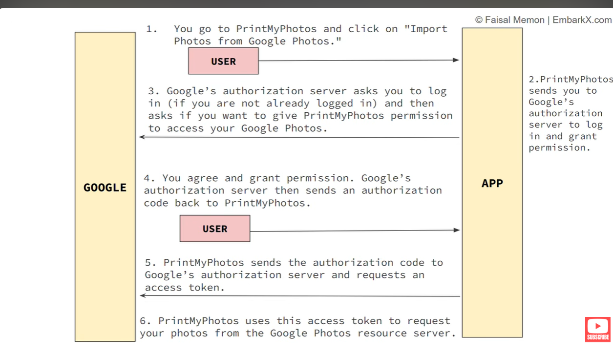

# FITNESS-TRACKER
This Application Tracks your activity and give awesome recommendation. 

----------------------------------------------
To start the rabit mq run this command but u must have docker on your sysytem --   
    [docker run -it --rm --name rabbitmq -p 5672:5672 -p 15672:15672 rabbitmq:4-management]


------------------------------------------------
eureka server is running on localhost:8761


-----------------------------------
gemini api request body 

@Data
@NoArgsConstructor
@AllArgsConstructor
public class GeminiRequestDTO {

    private List<Content> contents;

    @Data
    @NoArgsConstructor
    @AllArgsConstructor
    public static class Content {
        private List<Part> parts;
    }

    @Data
    @NoArgsConstructor
    @AllArgsConstructor
    public static class Part {
        private String text;
    }
}
String prompt = "Give me a fitness recommendation";

GeminiRequestDTO.Part part =
new GeminiRequestDTO.Part(prompt);

GeminiRequestDTO.Content content =
new GeminiRequestDTO.Content(List.of(part));

GeminiRequestDTO request =
new GeminiRequestDTO(List.of(content));
will become
{
"contents": [
{
"parts": [
{
"text": "Give me a fitness recommendation"
}
]
}
]
}
------------------------------------------

gemini api response body 

package com.fitness.aiService.dto.gemini;

import lombok.Data;

import java.util.List;

@Data
public class GeminiResponseDTO {

    private List<Candidate> candidates;

    @Data
    public static class Candidate {
        private Content content;
    }

    @Data
    public static class Content {
        private List<Part> parts;
    }

    @Data
    public static class Part {
        private String text;
    }
}

{
"candidates": [
{
"content": {
"parts": [
{
"text": "Your recommendation..."
}
]
}
}
]
}


------------------------------------------------------
response of AI 

{
"analysis": {
"overall": "The activity demonstrates a high-intensity cardiovascular effort, although the reported calorie burn and heart rate metrics suggest a potential discrepancy in data tracking or physiological strain.",
"pace": "Your average speed of 3.2 mph is a moderate, consistent walking pace, which is standard for a 30-minute brisk walk.",
"heartRate": "A maximum heart rate of 190 bpm is exceptionally high for a walking activity. This may indicate an inaccurate sensor reading or suggest that you are pushing your cardiovascular system into a near-maximal zone, which is atypical for standard walking.",
"caloriesBurned": "500 calories in 30 minutes of walking is statistically improbable for most individuals. This figure is significantly higher than the average burn rate for this activity, suggesting a potential calibration error with your tracking device."
},
"improvements": [
{
"area": "Heart Rate Monitoring",
"recommendation": "Verify the accuracy of your heart rate monitor. If using a wrist-based device, ensure it is snug and positioned correctly to prevent cadence lock, which often causes falsely high heart rate readings."
},
{
"area": "Calorie Tracking Calibration",
"recommendation": "Check the personal settings on your fitness app or device. Ensure your age, weight, and height are input correctly, as these metrics are vital for calculating realistic caloric expenditure."
}
],
"suggestions": [
{
"workout": "Interval Power Walking",
"description": "Incorporate 1-minute bursts of 'power walking' where you pump your arms and increase your speed, followed by 2 minutes of recovery pace. This will improve cardiovascular endurance without requiring excessive strain."
},
{
"workout": "Incline Walking",
"description": "If you have access to a treadmill or hilly terrain, introduce a 2-3% incline. This increases the intensity and muscle engagement of the workout while maintaining a safe, consistent pace."
}
],
"safety": [
"Consult with a healthcare professional regarding your 190 bpm max heart rate, as this is unusually high for a walking workout.",
"Prioritize a 5-minute warm-up and cool-down to allow your heart rate to transition gradually rather than spiking abruptly.",
"Listen to your body for signs of dizziness, chest pain, or extreme fatigue, and stop the activity immediately if these occur."
]
}




# 🏋️ Fitness Tracker

## AI-Powered Fitness Tracking System using Spring Boot Microservices

<p align="center">


</p>

---

# 📖 Table of Contents

1. [Introduction](#-introduction)
2. [Project Objective](#-project-objective)
3. [Application Features](#-application-features)
4. [Project Status](#-project-status)
5. [System Architecture](#-system-architecture)
6. [Complete End-to-End Flow](#-complete-end-to-end-flow)
7. [Microservices](#-microservices)
8. [Eureka Server](#-eureka-server)
9. [API Gateway](#-api-gateway)
10. [User Service](#-user-service)
11. [Fitness Activity Service](#-fitness-activity-service)
12. [AI Service](#-ai-service)
13. [RabbitMQ](#-rabbitmq)
14. [Google Gemini AI](#-google-gemini-ai)
15. [Database Architecture](#-database-architecture)
16. [PostgreSQL](#-postgresql)
17. [MongoDB](#-mongodb)
18. [Centralized Configuration](#-centralized-configuration)
19. [OpenFeign](#-openfeign)
20. [Synchronous vs Asynchronous Communication](#-synchronous-vs-asynchronous-communication)
21. [API Flow](#-api-flow)
22. [Recommendation Flow](#-recommendation-flow)
23. [Layered Architecture](#-layered-architecture)
24. [Security](#-security)
25. [Frontend](#-frontend)
26. [Configuration](#-configuration)
27. [Running the Project](#-running-the-project)
28. [Testing](#-testing)
29. [Why These Technologies](#-why-these-technologies)
30. [Future Enhancements](#-future-enhancements)
31. [Interview Explanation](#-interview-explanation)
32. [Learning Outcomes](#-learning-outcomes)

---

# 📖 Introduction

Fitness Tracker is an **AI-powered fitness management application** built using a **Spring Boot Microservices Architecture**.

The application is designed to manage fitness activities and generate AI-powered recommendations based on activity data.

Instead of building the complete application as one large monolithic application, the system is divided into multiple independent services. Each service is responsible for a specific business capability.

The major components are:

- 👤 User Service
- 🏃 Fitness Activity Service
- 🤖 AI Service
- 🚪 API Gateway
- 🔎 Eureka Server
- ⚙️ Config Server
- 🐇 RabbitMQ
- 🗄️ PostgreSQL
- 🍃 MongoDB
- 🧠 Google Gemini AI

The backend is being developed first, followed by authentication/authorization and a frontend application.

---

# 🎯 Project Objective

The main objective of this project is to understand how a real-world distributed application can be designed using microservices.

The project focuses on:

- Microservices architecture
- Service discovery
- API Gateway
- Centralized configuration
- REST APIs
- Database-per-service architecture
- Synchronous service communication
- Asynchronous messaging
- RabbitMQ
- OpenFeign
- AI integration
- Authentication and authorization
- Frontend integration
- Scalable and maintainable application design

The project also demonstrates an important real-world pattern:

> The activity service does not need to wait for the AI service to finish processing before returning a response to the user.

Instead, an activity event is published to RabbitMQ and the AI service processes it asynchronously.

---

# ✨ Application Features

## 👤 User Management

The User Service is responsible for user-related operations.

Typical responsibilities include:

- Creating users
- Retrieving users
- Validating users
- Maintaining user information
- Providing user-related APIs
- Persisting user data in PostgreSQL

---

## 🏃 Fitness Activity Management

The Fitness Activity Service manages fitness activities.

Examples:

- Walking
- Running
- Cycling
- Swimming
- Workout sessions

An activity can contain information such as:

- User ID
- Activity type
- Duration
- Calories burned
- Additional metrics
- Activity timestamp

The activity data is stored in MongoDB.

---

## 🤖 AI-Powered Fitness Analysis

The AI Service receives activity information and generates recommendations using Google Gemini.

The generated recommendation can contain:

- Overall activity analysis
- Pace analysis
- Heart-rate analysis
- Calorie analysis
- Areas for improvement
- Suggested workouts
- Safety recommendations

---

## 🐇 Asynchronous AI Processing

After an activity is saved, the Activity Service publishes an event to RabbitMQ.

The AI Service consumes the message from the RabbitMQ queue.

This creates the following flow:

```text
Activity Service
       |
       | Save activity
       v
    MongoDB
       |
       | Publish event
       v
   RabbitMQ
       |
       | Consume event
       v
    AI Service
       |
       | Call Gemini
       v
   Gemini AI
       |
       | Generate recommendation
       v
Recommendation
```

This prevents the Activity Service from being tightly coupled to the AI processing time.

---

# 🚧 Project Status

## ✅ Implemented

- Spring Boot microservices
- Eureka Server
- API Gateway
- User Service
- Fitness Activity Service
- MongoDB integration
- PostgreSQL integration
- RabbitMQ integration
- Asynchronous activity processing
- AI Service
- Google Gemini integration
- OpenFeign integration
- Recommendation generation
- Recommendation persistence
- Centralized configuration foundation

## 🔜 Planned / Next

- Spring Security
- JWT authentication
- Role-based authorization
- Complete frontend
- Frontend authentication
- Dashboard
- Activity charts
- Recommendation UI
- Production deployment
- Docker/containerization
- Improved observability

---

# 🏗️ System Architecture

```text
                         ┌──────────────────────┐
                         │      Frontend        │
                         │  Web / UI Application│
                         └──────────┬───────────┘
                                    │
                                    ▼
                         ┌──────────────────────┐
                         │     API Gateway      │
                         │       :8080          │
                         └──────────┬───────────┘
                                    │
                     ┌──────────────┼──────────────┐
                     │              │              │
                     ▼              ▼              ▼
             ┌─────────────┐ ┌─────────────┐ ┌─────────────┐
             │ User Service│ │   Activity  │ │  AI Service │
             │    :8081    │ │   Service   │ │    :8083    │
             └──────┬──────┘ │    :8082    │ └──────┬──────┘
                    │        └──────┬──────┘        │
                    ▼               │               │
             ┌─────────────┐        │               │
             │ PostgreSQL  │        │               │
             └─────────────┘        ▼               │
                                ┌──────────┐         │
                                │ RabbitMQ │◄────────┘
                                │ Exchange │
                                │ + Queue  │
                                └──────────┘

                                    │
                                    ▼
                              ┌───────────┐
                              │  Gemini   │
                              │    AI     │
                              └───────────┘


        ┌─────────────────────────────────────────┐
        │             Eureka Server :8761         │
        │             Service Registry            │
        └─────────────────────────────────────────┘

        ┌─────────────────────────────────────────┐
        │             Config Server :8888         │
        │        Centralized Configuration        │
        └─────────────────────────────────────────┘

        Activity Service + AI Service
                       │
                       ▼
                  ┌─────────┐
                  │ MongoDB │
                  └─────────┘
```

---

# 🧩 Microservices

The application is divided into the following services:

| Component | Port | Responsibility |
|---|---:|---|
| Eureka Server | 8761 | Service discovery |
| API Gateway | 8080 | Central entry point |
| User Service | 8081 | User management |
| Activity Service | 8082 | Fitness activities |
| AI Service | 8083 | AI recommendations |
| Config Server | 8888 | Centralized configuration |
| RabbitMQ | 5672 | Asynchronous messaging |
| RabbitMQ Management | 15672 | RabbitMQ web UI |

---

# 🔎 Eureka Server

## What is Eureka?

Eureka is a **service registry and service discovery server** provided by Netflix Eureka through Spring Cloud.

In a microservices environment, services need to find one another.

For example:

```text
Gateway
   |
   | Where is USER-SERVICE?
   |
   ▼
Eureka
   |
   | USER-SERVICE → localhost:8081
   |
   ▼
Gateway sends request
```

Instead of hardcoding service locations everywhere, services register themselves with Eureka.

---

## Why Eureka is Needed

Without service discovery:

```text
Gateway
   |
   └── http://localhost:8081
```

With service discovery:

```text
Gateway
   |
   └── lb://USER-SERVICE
              |
              ▼
           Eureka
              |
              ▼
        USER-SERVICE
```

This becomes especially useful when multiple instances of a service are running.

Example:

```text
USER-SERVICE

Instance 1 → 8081
Instance 2 → 8091
Instance 3 → 8101
```

The Gateway can use service discovery and load balancing instead of knowing every server address manually.

---

## Eureka Responsibilities

- Service registration
- Service discovery
- Maintaining service information
- Supporting dynamic service locations
- Helping services communicate without hardcoded hostnames

---

## Eureka Dashboard

The Eureka dashboard can be accessed locally at:

```text
http://localhost:8761
```

The dashboard shows registered services such as:

```text
ACTIVITY-SERVICE
AI-SERVICE
GATEWAY
USER-SERVICE
```

---

# 🚪 API Gateway

## What is an API Gateway?

The API Gateway is the **single entry point** for client requests.

Instead of the frontend directly communicating with every microservice:

```text
Frontend
   |
   +--> User Service
   |
   +--> Activity Service
   |
   +--> AI Service
```

the frontend communicates with the Gateway:

```text
Frontend
   |
   ▼
API Gateway
   |
   +--> User Service
   +--> Activity Service
   +--> AI Service
```

---

## Why API Gateway is Used

The Gateway provides a centralized place for:

- Routing
- Authentication
- Authorization
- CORS handling
- Logging
- Monitoring
- Request filtering
- Load balancing

Security is planned to be integrated at the Gateway layer.

---

## Gateway Routing

Example route:

```yaml
spring:
  cloud:
    gateway:
      server:
        webflux:
          routes:
            - id: user-service
              uri: lb://USER-SERVICE
              predicates:
                - Path=/api/users/**
```

The important part is:

```text
lb://USER-SERVICE
```

`lb` means the request is handled using service discovery and load balancing.

---

## Example

Client calls:

```text
GET /api/users/123
```

The request goes:

```text
Client
   |
   ▼
Gateway :8080
   |
   ▼
Eureka
   |
   ▼
USER-SERVICE :8081
   |
   ▼
Controller
```

The client does not need to know the internal port of the User Service.

---

# 👤 User Service

The User Service manages user-related business operations.

It is responsible for:

- User creation
- User retrieval
- User validation
- User information
- User persistence

The User Service uses PostgreSQL because user information is structured and relational in nature.

---

## User Service Architecture

```text
Client
   |
   ▼
API Gateway
   |
   ▼
User Controller
   |
   ▼
User Service
   |
   ▼
User Repository
   |
   ▼
PostgreSQL
```

---

## Layer Responsibilities

### Controller

The Controller handles HTTP requests.

Example:

```text
GET /api/users/{id}
```

The Controller should mainly handle:

- Request mapping
- Request parameters
- Request body
- Response creation
- Validation

It should not contain large business logic.

---

### Service

The Service layer contains business logic.

Example:

```java
public User getUserById(String id)
```

The Service decides what should happen with the request.

---

### Repository

The Repository communicates with the database.

For example:

```java
public interface UserRepository extends JpaRepository<User, UUID> {
}
```

The Repository provides database operations without requiring manual SQL for every basic operation.

---

## Why Separate Controller, Service and Repository?

This separation follows the layered architecture pattern.

```text
Controller
    ↓
Service
    ↓
Repository
    ↓
Database
```

Each layer has a specific responsibility.

Benefits:

- Better maintainability
- Easier testing
- Separation of concerns
- Cleaner code
- Easier debugging
- Better scalability

---

# 🏃 Fitness Activity Service

The Fitness Activity Service is responsible for managing fitness activities.

Examples:

```text
WALKING
RUNNING
CYCLING
SWIMMING
WORKOUT
```

An activity can contain:

```text
Activity ID
User ID
Activity Type
Duration
Calories Burned
Additional Metrics
Created At
```

---

## Activity Service Architecture

```text
Client
   |
   ▼
API Gateway
   |
   ▼
Activity Controller
   |
   ▼
Activity Service
   |
   ▼
Activity Repository
   |
   ▼
MongoDB
```

After saving:

```text
Activity Service
      |
      ▼
 Save Activity
      |
      ▼
 MongoDB
      |
      ▼
 Publish Activity Event
      |
      ▼
 RabbitMQ
```

---

## Why MongoDB?

Fitness activity information can contain different metrics depending on the activity type.

For example:

```json
{
  "type": "RUNNING",
  "duration": 30,
  "caloriesBurned": 280,
  "additionalMetrics": {
    "distance": 4.2,
    "averageSpeed": 8.4
  }
}
```

Another activity may contain different metrics.

MongoDB provides a flexible document structure that works well for this kind of activity data.

---

# 🐇 RabbitMQ

## What is RabbitMQ?

RabbitMQ is a **message broker**.

It allows applications and microservices to communicate asynchronously.

In this project RabbitMQ connects:

```text
Activity Service
       |
       ▼
   RabbitMQ
       |
       ▼
   AI Service
```

---

## Why RabbitMQ?

Imagine the Activity Service receives:

```text
POST /api/activities
```

If it directly calls Gemini and waits:

```text
User
  |
  ▼
Activity Service
  |
  ▼
Gemini AI
  |
  | wait...
  |
  ▼
Response
```

The user has to wait for AI processing.

With RabbitMQ:

```text
User
  |
  ▼
Activity Service
  |
  +--> Save Activity
  |
  +--> Publish Message
          |
          ▼
       RabbitMQ
          |
          ▼
       AI Service
```

The Activity Service can return much faster.

---

# 📦 RabbitMQ Components

RabbitMQ commonly involves:

```text
Producer
    |
    ▼
 Exchange
    |
    ▼
 Binding
    |
    ▼
 Queue
    |
    ▼
 Consumer
```

In this project:

```text
Activity Service
      |
      | Producer
      ▼
fitness.exchange
      |
      | routing key:
      | activity.tracking
      ▼
activity.queue
      |
      ▼
AI Service
      |
      | Consumer
      ▼
AI Processing
```

---

## Producer

The Activity Service acts as the producer.

It publishes activity information to RabbitMQ.

---

## Exchange

The exchange acts as the routing hub.

Project exchange:

```text
fitness.exchange
```

---

## Routing Key

The routing key determines how a message is routed.

Project routing key:

```text
activity.tracking
```

---

## Queue

The queue stores messages until a consumer processes them.

Project queue:

```text
activity.queue
```

---

## Consumer

The AI Service consumes messages from:

```text
activity.queue
```

Example:

```java
@RabbitListener(queues = "activity.queue")
public void onMessage(Activity activity) {
    // Process activity
}
```

---

# 🔄 RabbitMQ Message Flow

```text
                  Activity Service
                        |
                        | publish()
                        ▼
                ┌─────────────────┐
                │ fitness.exchange│
                └────────┬────────┘
                         |
                  routing key
               activity.tracking
                         |
                         ▼
                ┌─────────────────┐
                │ activity.queue  │
                └────────┬────────┘
                         |
                         ▼
                   AI Service
                  @RabbitListener
```

---

# 🤖 AI Service

The AI Service is responsible for generating AI-powered fitness recommendations.

It receives an activity event from RabbitMQ.

The processing flow is:

```text
RabbitMQ
   |
   ▼
AI Service
   |
   ▼
Build AI Prompt
   |
   ▼
Gemini API
   |
   ▼
AI Generated JSON
   |
   ▼
Convert JSON
   |
   ▼
Recommendation Object
   |
   ▼
MongoDB
```

---

## AI Service Responsibilities

- Consume activity events
- Build AI prompts
- Call Gemini
- Process AI response
- Convert response into application DTOs
- Save recommendations
- Retrieve recommendations
- Return recommendation data through APIs

---

# 🧠 Google Gemini AI

Google Gemini is used as the AI engine.

The Activity Service sends information such as:

```text
Activity Type
Duration
Calories Burned
Additional Metrics
```

The AI Service converts this information into a structured prompt.

---

## Example Prompt Concept

```text
Analyze this fitness activity.

Activity Type: WALKING
Duration: 30 minutes
Calories Burned: 150

Provide:

1. Overall analysis
2. Pace analysis
3. Heart rate analysis
4. Calorie analysis
5. Improvements
6. Suggested workouts
7. Safety recommendations
```

Gemini generates the recommendation.

---

# 📋 Structured AI Response

The application requests a structured JSON response:

```json
{
  "analysis": {
    "overall": "Overall analysis",
    "pace": "Pace analysis",
    "heartRate": "Heart rate analysis",
    "caloriesBurned": "Calories analysis"
  },
  "improvements": [
    {
      "area": "Heart Rate Monitoring",
      "recommendation": "Detailed recommendation"
    }
  ],
  "suggestions": [
    {
      "workout": "Interval Power Walking",
      "description": "Detailed workout description"
    }
  ],
  "safety": [
    "Safety recommendation"
  ]
}
```

Structured responses make it easier for the application to store and display AI output.

---

# 🔗 OpenFeign

OpenFeign is used to communicate with the Gemini API.

Instead of manually creating HTTP requests using low-level HTTP code, Feign allows the external API to be represented as a Java interface.

Conceptually:

```text
AI Service
    |
    ▼
GeminiFeignClient
    |
    ▼
Gemini REST API
```

Example:

```java
@FeignClient(
    name = "geminiClient",
    url = "${gemini.base-url}"
)
public interface GeminiFeignClient {

    @PostMapping(
        "/v1beta/models/gemini-3.1-flash-lite:generateContent"
    )
    GeminiResponseDTO generateContent(
        @RequestHeader("X-goog-api-key") String apiKey,
        @RequestBody GeminiRequestDTO request
    );
}
```

---

# 🔄 Synchronous vs Asynchronous Communication

The project uses both communication styles.

## Synchronous Communication

The caller waits for the response.

Example:

```text
Frontend
   |
   ▼
Gateway
   |
   ▼
User Service
   |
   ▼
Response
```

The request remains active until the User Service responds.

---

## Asynchronous Communication

The sender publishes a message and does not need to wait for the complete downstream processing.

Example:

```text
Activity Service
      |
      ▼
   RabbitMQ
      |
      ▼
   AI Service
```

The AI processing happens independently.

---

## Why Use Both?

Not every operation needs messaging.

For request/response operations:

```text
REST + Feign
```

is convenient.

For background processing:

```text
RabbitMQ
```

is more appropriate.

The project therefore demonstrates both communication patterns.

---

# 🗄️ Database Architecture

The project follows the **database-per-service** concept.

```text
User Service
     |
     ▼
PostgreSQL


Activity Service
     |
     ▼
MongoDB


AI Service
     |
     ▼
MongoDB
```

The services do not need to share one common database schema.

This provides better service independence.

---

# 🐘 PostgreSQL

PostgreSQL is used by the User Service.

User information is naturally structured:

```text
User
 ├── ID
 ├── Name
 ├── Email
 └── Other details
```

Relational databases are suitable for structured data and transactional operations.

---

# 🍃 MongoDB

MongoDB is used for fitness activity and recommendation data.

MongoDB stores data as documents.

Example activity:

```json
{
  "userId": "user-123",
  "type": "WALKING",
  "duration": 30,
  "caloriesBurned": 150
}
```

Example recommendation:

```json
{
  "activityId": "activity-123",
  "userId": "user-123",
  "activityType": "WALKING",
  "analysis": {
    "overall": "Good activity",
    "pace": "Moderate pace",
    "heartRate": "Within expected range",
    "caloriesBurned": "Reasonable"
  },
  "improvements": [],
  "suggestions": [],
  "safety": []
}
```

---

# ⚙️ Centralized Configuration

The project includes a Config Server.

The Config Server runs on:

```text
http://localhost:8888
```

Its purpose is to centralize application configuration.

Instead of maintaining all configuration independently, configuration can be stored centrally.

Examples:

- Database configuration
- RabbitMQ configuration
- Eureka configuration
- Service-specific properties
- Environment-specific settings

---

## Config Server Architecture

```text
                Config Server
                    :8888
                      |
        ┌─────────────┼─────────────┐
        │             │             │
        ▼             ▼             ▼
   User Service  Activity Service  AI Service
```

This reduces configuration duplication and makes configuration management easier.

---

# 🧱 Layered Architecture

Each business service follows a layered structure.

```text
Controller
    |
    ▼
Service
    |
    ▼
Repository
    |
    ▼
Database
```

For services involving external communication:

```text
Controller
    |
    ▼
Service
    |
    +----> Repository
    |
    +----> Feign Client
    |
    +----> RabbitMQ
```

---

# 🧩 Controller Layer

Responsible for:

- REST endpoints
- HTTP requests
- Request validation
- HTTP responses

Example:

```java
@RestController
@RequestMapping("/api/activities")
public class ActivityController {
}
```

---

# ⚙️ Service Layer

Contains business logic.

Example responsibilities:

```text
Validate activity
      ↓
Save activity
      ↓
Publish event
```

The service layer prevents business logic from being placed directly inside controllers.

---

# 🗃️ Repository Layer

Responsible for database operations.

Examples:

```java
MongoRepository
JpaRepository
```

For recommendations:

```java
public interface RecommendationRepository
        extends MongoRepository<Recommendation, String> {

    List<Recommendation> findByUserId(String userId);

    Optional<Recommendation> findByActivityId(String activityId);
}
```

Spring Data derives queries from entity property names.

For example:

```text
findByUserId()
```

means:

```text
Find Recommendation where userId = ?
```

---

# 📊 Recommendation Management

The AI Service stores recommendations after Gemini processing.

Recommendations can be retrieved by:

### Activity ID

```text
GET /api/recommendations/activity/{activityId}
```

### User ID

```text
GET /api/recommendations/user/{userId}
```

The service maps database entities to response DTOs.

---

# 🔁 Recommendation Flow

```text
Activity Created
      |
      ▼
Activity Service
      |
      ▼
MongoDB
      |
      ▼
RabbitMQ
      |
      ▼
AI Service
      |
      ▼
Gemini
      |
      ▼
AI JSON
      |
      ▼
Recommendation Entity
      |
      ▼
MongoDB
      |
      ▼
Recommendation API
      |
      ▼
Frontend
```

---

# 🌐 Complete API Flow

A typical request travels through the system as follows:

```text
                ┌────────────┐
                │  Frontend  │
                └─────┬──────┘
                      |
                      ▼
                ┌────────────┐
                │   Gateway  │
                │    :8080   │
                └─────┬──────┘
                      |
                ┌─────┴──────┐
                ▼            ▼
          User Service   Activity Service
              :8081           :8082
                |               |
                ▼               ▼
          PostgreSQL         MongoDB
                                |
                                ▼
                            RabbitMQ
                                |
                                ▼
                           AI Service
                              :8083
                                |
                                ▼
                           Gemini AI
                                |
                                ▼
                          Recommendation
                                |
                                ▼
                             MongoDB
```

---

# 🛡️ Security

Security is planned as the next major part of the application.

The planned security architecture includes:

- Spring Security
- JWT authentication
- Authentication endpoint
- Authorization
- Role-based access
- Gateway authentication
- Secure service communication
- Password hashing
- Token validation

The planned flow is:

```text
User
 |
 | Login
 ▼
User/Auth Service
 |
 | JWT
 ▼
Client
 |
 | JWT
 ▼
API Gateway
 |
 | Validate token
 ▼
Microservices
```

Security is not considered fully implemented until the authentication and authorization flow is completed.

---

# 🖥️ Frontend

The frontend is planned as the user-facing layer.

The frontend will communicate primarily with the API Gateway.

Planned screens include:

```text
Login
  |
  ▼
Dashboard
  |
  ├── Profile
  |
  ├── Activities
  |
  ├── Add Activity
  |
  ├── Activity History
  |
  └── AI Recommendations
```

---

## Planned Dashboard

The dashboard can display:

- Total activities
- Calories burned
- Workout duration
- Activity history
- Recent recommendations
- Fitness statistics
- Charts and graphs

---

# 🔐 Configuration and Secrets

Sensitive values should not be hardcoded into source code.

For example:

```yaml
spring:
  datasource:
    password: ${DB_PASSWORD}

gemini:
  api:
    key: ${GEMINI_API_KEY}
```

Environment variables should be used for:

- Database passwords
- API keys
- JWT secrets
- Production credentials

Example:

```text
DB_PASSWORD=********
GEMINI_API_KEY=********
JWT_SECRET=********
```

Never commit real credentials to GitHub.

---

# ▶️ Running the Project

## 1. Start PostgreSQL

Make sure PostgreSQL is running.

Create/configure the database required by the User Service.

---

## 2. Start MongoDB

Make sure MongoDB is running.

The Activity and AI services use MongoDB for document storage.

---

## 3. Start RabbitMQ

RabbitMQ should be running on:

```text
AMQP:
5672
```

RabbitMQ Management UI:

```text
15672
```

The management UI is for administration.

Application messaging uses port:

```text
5672
```

---

## 4. Start Eureka Server

Run:

```text
Eureka Server
```

Port:

```text
8761
```

Open:

```text
http://localhost:8761
```

---

## 5. Start Config Server

Run:

```text
Config Server
```

Port:

```text
8888
```

---

## 6. Start User Service

Run:

```text
User Service
```

Port:

```text
8081
```

Verify that it registers with Eureka.

---

## 7. Start Activity Service

Run:

```text
Activity Service
```

Port:

```text
8082
```

Verify:

- MongoDB connection
- RabbitMQ connection
- Eureka registration

---

## 8. Start AI Service

Run:

```text
AI Service
```

Port:

```text
8083
```

Verify:

- RabbitMQ connection
- MongoDB connection
- Gemini API configuration
- Eureka registration

---

## 9. Start API Gateway

Run:

```text
API Gateway
```

Port:

```text
8080
```

The Gateway should discover services through Eureka.

---

# 🧪 Testing

Postman can be used to test the APIs.

Recommended testing order:

```text
1. Check Eureka
2. Check User Service
3. Check Activity Service
4. Check RabbitMQ
5. Check AI Service
6. Test complete activity → AI flow
7. Test recommendation retrieval
8. Test Gateway routes
```

---

# 🧪 Example Activity Flow

Send an activity request through the Gateway:

```text
POST http://localhost:8080/api/activities
```

Example body:

```json
{
  "userId": "user-123",
  "type": "WALKING",
  "duration": 30,
  "caloriesBurned": 150,
  "additionalMetrics": {
    "distance": 2.5
  }
}
```

Expected flow:

```text
POST Request
     |
     ▼
Gateway
     |
     ▼
Activity Service
     |
     ▼
Save MongoDB
     |
     ▼
Publish RabbitMQ Message
     |
     ▼
AI Service
     |
     ▼
Gemini
     |
     ▼
Save Recommendation
```

---

# 🔍 Recommendation Retrieval

After AI processing, recommendations can be retrieved using:

```text
GET /api/recommendations/activity/{activityId}
```

or:

```text
GET /api/recommendations/user/{userId}
```

The response is mapped into:

```text
RecommendationResponse
```

which contains:

```text
id
activityId
userId
activityType
analysis
improvements
suggestions
safety
createdAt
```

---

# 🧠 Why These Technologies?

| Technology | Why It Is Used |
|---|---|
| Java 21 | Modern Java platform |
| Spring Boot | Rapid backend development |
| Spring Cloud | Microservices infrastructure |
| Eureka | Service discovery |
| API Gateway | Central request routing |
| PostgreSQL | Structured user data |
| MongoDB | Flexible activity/recommendation documents |
| RabbitMQ | Asynchronous communication |
| OpenFeign | Declarative HTTP communication |
| Gemini | AI-powered analysis |
| Maven | Dependency/build management |
| Git | Version control |
| Postman | API testing |

---

# 🏆 Why Microservices?

A monolithic application could contain:

```text
User
Activity
AI
Authentication
All in one application
```

The microservices architecture separates them:

```text
User Service
Activity Service
AI Service
Gateway
Eureka
Config Server
```

Advantages:

- Independent deployment
- Independent scaling
- Separation of responsibilities
- Fault isolation
- Technology flexibility
- Easier maintenance
- Team ownership
- Better scalability

---

# ⚡ Why Asynchronous Processing?

AI processing can take longer than a normal CRUD operation.

Instead of:

```text
Activity Request
      |
      ▼
Activity Service
      |
      ▼
Gemini
      |
      ▼
Wait
      |
      ▼
Response
```

the project uses:

```text
Activity Request
      |
      ▼
Activity Service
      |
      ├── Save Activity
      |
      └── Publish Event
              |
              ▼
           RabbitMQ
              |
              ▼
          AI Service
              |
              ▼
           Gemini
```

This allows the activity operation and AI processing to be decoupled.

---

# 🧯 Error Handling Considerations

Distributed systems need to consider failures.

Examples:

```text
Gemini unavailable
RabbitMQ unavailable
MongoDB unavailable
User Service unavailable
Network failure
Invalid AI response
```

Potential production improvements include:

- Retry mechanisms
- Dead Letter Queues
- Circuit breakers
- Timeouts
- Exception handling
- Structured logging
- Monitoring
- Distributed tracing

For RabbitMQ consumers, retry limits and a Dead Letter Queue can prevent a permanently failing message from being processed repeatedly.

---

# 📈 Scalability

The architecture allows individual services to scale independently.

For example:

```text
User Service
   ├── Instance 1
   └── Instance 2


Activity Service
   ├── Instance 1
   ├── Instance 2
   └── Instance 3


AI Service
   ├── Instance 1
   └── Instance 2
```

Eureka can keep track of service instances, while the Gateway can use load balancing.

---

# 🔮 Future Enhancements

Planned improvements include:

## Security

- JWT authentication
- Spring Security
- Role-based authorization
- Refresh tokens
- Secure password storage

## Frontend

- Responsive dashboard
- Activity charts
- Recommendation cards
- Authentication UI
- User profile
- Activity history

## Infrastructure

- Docker
- Docker Compose
- Kubernetes
- Cloud deployment
- CI/CD

## Observability

- Spring Boot Actuator
- Centralized logging
- Metrics
- Distributed tracing
- Health checks

## AI

- More detailed fitness analysis
- Personalized workout plans
- Personalized diet suggestions
- Long-term activity analysis
- AI-based progress tracking

---

# 🗺️ Development Roadmap

```text
                    FITNESS TRACKER
                          |
          ┌───────────────┴───────────────┐
          ▼                               ▼
     Backend Core                     Frontend
          |
   ┌──────┼──────┬──────┐
   ▼      ▼      ▼      ▼
 Eureka Gateway User Activity
                         |
                         ▼
                      RabbitMQ
                         |
                         ▼
                      AI Service
                         |
                         ▼
                     Gemini AI
                         |
                         ▼
                 Recommendation
                         |
                         ▼
                    MongoDB

Next:
   |
   ├── Security
   ├── JWT
   ├── Frontend
   ├── Docker
   ├── Monitoring
   └── Deployment
```

---

# 🎤 Interview Explanation

## Short Version

> I developed an AI-powered Fitness Tracker using Spring Boot microservices. The application is divided into User, Activity, and AI services, with Eureka for service discovery and an API Gateway as the central entry point. User data is stored in PostgreSQL, while activity and recommendation data are stored in MongoDB. When an activity is created, the Activity Service stores it and publishes an event to RabbitMQ. The AI Service consumes that event asynchronously, calls Google Gemini through OpenFeign, generates structured fitness recommendations, and stores them in MongoDB. This architecture helps decouple activity processing from AI processing and provides a scalable foundation for adding security and a frontend.

---

# 🎤 Detailed Interview Flow

If asked:

### "What happens when a user creates an activity?"

Answer:

> The request first reaches the API Gateway. The Gateway uses Eureka service discovery to route the request to the Activity Service. The Activity Service validates and saves the activity in MongoDB. After successful persistence, it publishes an activity event to a RabbitMQ exchange using a routing key. RabbitMQ routes the message to the activity queue. The AI Service listens to that queue and consumes the activity asynchronously. It then builds a prompt and calls Google Gemini through OpenFeign. Gemini returns structured fitness recommendations, which the AI Service converts into the application's recommendation model and stores in MongoDB. The recommendation can later be retrieved through the recommendation API.

---

# 🎤 Why RabbitMQ?

> I used RabbitMQ because AI processing is an asynchronous background operation. I don't want the Activity Service to remain blocked while waiting for AI processing. The Activity Service publishes an event and the AI Service processes it independently. This reduces coupling and improves responsiveness.

---

# 🎤 Why MongoDB?

> Fitness activities can contain different metrics depending on the activity type. MongoDB's document-oriented and flexible schema is suitable for storing these activity documents and AI recommendation documents.

---

# 🎤 Why PostgreSQL?

> User information is structured and relational, so PostgreSQL is a good fit for maintaining user data and transactional operations.

---

# 🎤 Why Eureka?

> Eureka provides service discovery. Instead of hardcoding service hostnames and ports, services register themselves with Eureka and clients such as the API Gateway can discover them dynamically.

---

# 🎤 Why API Gateway?

> The API Gateway provides a single entry point for clients and handles routing. It also gives us a centralized place for cross-cutting concerns such as authentication, authorization, CORS, logging, and request filtering.

---

# 🎤 Why OpenFeign?

> OpenFeign provides declarative HTTP communication. Instead of manually constructing HTTP requests, I define an interface representing the external API and Feign handles the HTTP communication.

---

# 🎤 Why Both REST and RabbitMQ?

> REST is suitable when I need an immediate request-response interaction. RabbitMQ is suitable for asynchronous processing where the caller does not need to wait for downstream processing. This project uses both patterns according to the business requirement.

---

# 🧠 Key Microservices Concepts Demonstrated

This project demonstrates:

```text
                 Microservices
                      |
        ┌─────────────┼─────────────┐
        ▼             ▼             ▼
 Service Discovery  API Gateway  Config Server
        |
        ▼
Communication
   ├── REST
   ├── OpenFeign
   └── RabbitMQ
        |
        ▼
Data
   ├── PostgreSQL
   └── MongoDB
        |
        ▼
AI
   └── Google Gemini
        |
        ▼
Security
   └── Planned
        |
        ▼
Frontend
   └── Planned
```

---

# 📚 Learning Outcomes

Through this project, the following concepts are practiced:

### Java

- Java 21
- Records
- Collections
- Streams
- Exception handling
- Object-oriented programming

### Spring Boot

- REST APIs
- Dependency Injection
- Configuration
- Validation
- Spring Data
- Service/Repository architecture

### Spring Cloud

- Eureka
- API Gateway
- Config Server
- OpenFeign
- Load balancing

### Databases

- PostgreSQL
- MongoDB
- JPA
- Hibernate
- MongoRepository

### Messaging

- RabbitMQ
- Exchanges
- Queues
- Routing keys
- Bindings
- Producers
- Consumers
- Asynchronous processing

### AI

- Google Gemini API
- Prompt engineering
- Structured AI responses
- AI response DTO mapping

### Development Tools

- IntelliJ IDEA
- Maven
- Git
- Postman

---

# 📁 Suggested Project Structure

```text
FITNESS-TRACKER/
│
├── eureka-server/
│
├── gateway/
│
├── user-service/
│
├── activity-service/
│
├── ai-service/
│
├── config-server/
│
├── config/
│
└── README.md
```

Individual services can follow:

```text
src/
└── main/
    ├── java/
    │   └── com.fitness/
    │       ├── controller/
    │       ├── service/
    │       │   └── impl/
    │       ├── repository/
    │       ├── model/
    │       ├── dto/
    │       ├── config/
    │       └── exception/
    │
    └── resources/
        └── application.yml
```

---

# 🔐 Security Best Practices

Never commit secrets such as:

```text
Database Password
Gemini API Key
JWT Secret
Cloud Credentials
```

Use:

```text
Environment Variables
Secret Management
External Configuration
```

For example:

```yaml
gemini:
  api:
    key: ${GEMINI_API_KEY}
```

---

# 🧪 Testing Strategy

The project can be tested at multiple levels.

## Unit Testing

Test individual:

- Service methods
- Utility methods
- Business rules

## Integration Testing

Test:

- Database integration
- RabbitMQ integration
- REST APIs
- Feign communication

## End-to-End Testing

Test the complete flow:

```text
Client
  ↓
Gateway
  ↓
Activity Service
  ↓
MongoDB
  ↓
RabbitMQ
  ↓
AI Service
  ↓
Gemini
  ↓
MongoDB
```

---

# 🌟 Project Highlights

The most important architectural feature of this project is the combination of:

```text
Microservices
      +
Service Discovery
      +
API Gateway
      +
Database per Service
      +
RabbitMQ
      +
OpenFeign
      +
Generative AI
```

This creates a distributed system that demonstrates both traditional backend development and modern AI integration.

---

# 👨‍💻 Author

**Arbaaz Alam**

Java Full Stack Developer

### Technologies

```text
Java 21
Spring Boot
Spring Cloud
Spring Data JPA
Hibernate
REST APIs
Microservices
PostgreSQL
MongoDB
RabbitMQ
OpenFeign
Google Gemini
Angular / Frontend
Git
Maven
Postman
```

---

# ⭐ Final Architecture Summary

```text
                         ┌─────────────────┐
                         │    FRONTEND     │
                         │     Planned     │
                         └────────┬────────┘
                                  │
                                  ▼
                         ┌─────────────────┐
                         │  API GATEWAY    │
                         │      :8080      │
                         └────────┬────────┘
                                  │
                    ┌─────────────┼─────────────┐
                    │             │             │
                    ▼             ▼             ▼
             ┌────────────┐ ┌────────────┐ ┌────────────┐
             │    USER    │ │  ACTIVITY  │ │     AI     │
             │  SERVICE   │ │  SERVICE   │ │  SERVICE   │
             │   :8081    │ │   :8082    │ │   :8083    │
             └─────┬──────┘ └─────┬──────┘ └─────┬──────┘
                   │              │               │
                   ▼              ▼               │
             PostgreSQL        MongoDB            │
                                  │               │
                                  ▼               │
                           ┌─────────────┐        │
                           │  RabbitMQ   │────────┘
                           │   Exchange  │
                           │    Queue    │
                           └─────────────┘
                                  │
                                  ▼
                           ┌─────────────┐
                           │   Gemini    │
                           │     AI      │
                           └─────────────┘


        ┌──────────────────────────────────────┐
        │         EUREKA SERVER :8761          │
        │          Service Discovery           │
        └──────────────────────────────────────┘

        ┌──────────────────────────────────────┐
        │         CONFIG SERVER :8888          │
        │       Centralized Configuration      │
        └──────────────────────────────────────┘
```

---

# 🚀 Project Vision

The long-term goal is to evolve this project into a complete fitness platform where users can:

```text
Register / Login
       ↓
Create Fitness Activities
       ↓
Track Activity History
       ↓
Receive AI Analysis
       ↓
Get Personalized Recommendations
       ↓
Monitor Progress
       ↓
Improve Fitness Performance
```

The project combines **Spring Boot Microservices + Event-Driven Architecture + Generative AI** to create a practical, scalable fitness application.
